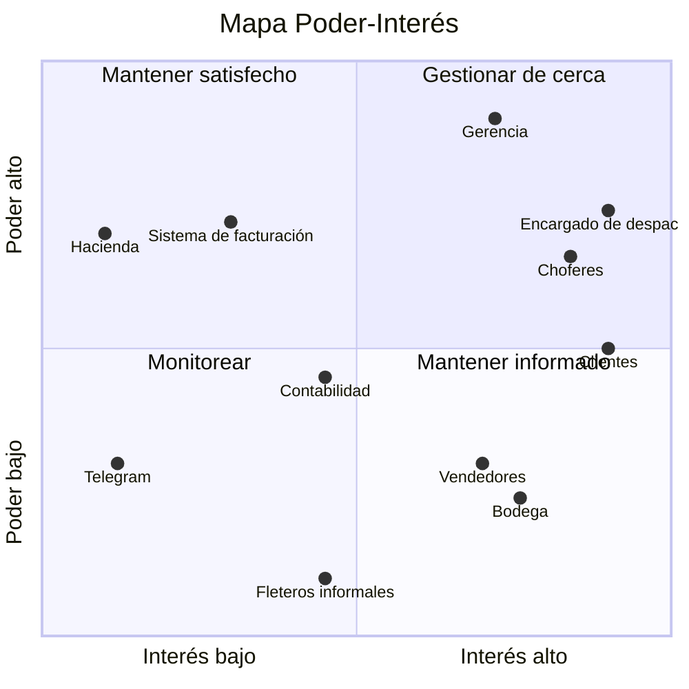

# Sistema de apoyo a la decisión para la asignación de transporte de materiales de construcción

**Universidad Técnica Nacional — Sede Regional de San Carlos**

| | |
|---|---|
| **Curso** | ISW-912 Administración de Proyectos Informáticos |
| **Estudiantes** | Edgar Eliam Araya Alvarado José Pablo Chaves Madris |
| **Profesor** | Deiver Cubero Molina |
| **Lugar y año** | San Carlos, Costa Rica, 2026 |

---

## Tabla de contenidos

- [Semana 1: Del problema al proyecto](#semana-1-del-problema-al-proyecto)
  - [Problema](#problema)
  - [Proyecto propuesto](#proyecto-propuesto)
  - [Valor esperado](#valor-esperado)
  - [Objetivo general](#objetivo-general)
  - [Objetivos específicos](#objetivos-específicos)
- [Semana 2: Interesados del proyecto](#semana-2-interesados-del-proyecto)
  - [Registro de interesados](#registro-de-interesados)
  - [Justificación de casos discutibles](#justificación-de-casos-discutibles)
  - [Mapa Poder-Interés](#mapa-poder-interés)
  - [Interesados críticos y estrategia de involucramiento](#interesados-críticos-y-estrategia-de-involucramiento)
  - [Preguntas de análisis](#preguntas-de-análisis)
  - [Enfoque de gestión del proyecto](#enfoque-de-gestión-del-proyecto)

---

## Semana 1: Del problema al proyecto

### Problema

En la empresa X, dedicada a la venta de materiales de construcción, muchos clientes compran productos pesados o voluminosos que no pueden transportar en un vehículo particular, como cemento, varilla, block, láminas o arena. Actualmente, el cliente debe buscar por su cuenta un fletero o esperar a que la empresa coordine una entrega de forma manual.

Esto provoca varios problemas:

- atrasos en la entrega;
- poca claridad sobre el costo y la hora de llegada;
- falta de seguimiento del pedido;
- en algunos casos, la pérdida de la venta, porque el cliente prefiere comprar en otro negocio que sí le ofrece transporte.

Además, elegir el vehículo adecuado para cada carga depende de cálculos manuales y de la experiencia de quien coordina. Esto puede generar errores, como enviar un vehículo que no soporta el peso o que no tiene espacio para piezas largas. También puede pasar lo contrario: usar un camión grande para una carga pequeña, lo que aumenta los costos.

### Proyecto propuesto

Se propone desarrollar una aplicación integrada con el sistema de facturación de la empresa X. Cuando un cliente solicita transporte para su compra, el sistema analiza automáticamente los productos facturados y calcula el peso total, el volumen y las dimensiones de la carga, como el largo y la altura.

Con esta información, el sistema descarta los vehículos que no pueden transportar la carga o que no están disponibles. Luego genera un conjunto de propuestas con las mejores combinaciones de vehículo y chofer, ordenadas según:

- la capacidad del vehículo frente a la carga;
- la cercanía del chofer;
- el costo del flete.

Estas propuestas se envían por Telegram a un encargado de despacho con experiencia, quien toma la decisión final. Puede seleccionar la opción más adecuada o ajustarla si identifica condiciones que el sistema no contempla, como el acceso al lugar de entrega o requerimientos especiales de descarga.

Una vez aprobada la asignación, el sistema notifica al chofer y al cliente y permite dar seguimiento a la entrega. Las decisiones del encargado quedan registradas, lo que permitirá mejorar las propuestas del sistema con el tiempo.

### Valor esperado

- **Clientes:** reciben sus materiales en menos tiempo, conocen el costo del flete desde el inicio y pueden dar seguimiento a su entrega.
- **Empresa:** mejora el servicio al cliente, reduce las ventas perdidas por falta de transporte, ordena el proceso de despacho y disminuye los errores al elegir vehículos.
- **Encargado de despacho:** toma decisiones más rápidas y mejor fundamentadas, ya que recibe opciones calculadas y filtradas en lugar de hacer todo el análisis manualmente.
- **Choferes:** obtienen un flujo más constante y ordenado de trabajo.

El valor se podrá medir con los siguientes indicadores:

- reducción del tiempo entre la compra y la entrega;
- aumento en la cantidad de compras que incluyen servicio de transporte;
- disminución de asignaciones incorrectas de vehículos;
- nivel de satisfacción de los clientes.

### Objetivo general

Desarrollar una aplicación que, a partir de la factura de compra, calcule las características de la carga y proponga las mejores opciones de vehículo y chofer para que un encargado de despacho tome la decisión final, con el fin de reducir los tiempos de entrega de materiales de construcción y mejorar la experiencia del cliente en la empresa X.

### Objetivos específicos

1. Integrar la aplicación con el sistema de facturación para generar automáticamente una solicitud de transporte a partir de cada compra.
2. Calcular el peso, el volumen y las dimensiones de la carga con base en la información de los productos facturados.
3. Generar propuestas de vehículo y chofer ordenadas según la capacidad, la disponibilidad, la cercanía y el costo.
4. Enviar las propuestas a un encargado de despacho mediante Telegram para que tome la decisión final de asignación.
5. Notificar al chofer y al cliente, y permitir el seguimiento del estado de la entrega.

---

## Semana 2: Interesados del proyecto

### Registro de interesados

Escala de poder e interés: 1 (muy bajo) a 5 (muy alto). Actitud: favorable, neutral, mixta (tiene dudas o intereses encontrados) o resistente.

| # | Interesado | Rol / relación | Necesidad | Poder | Interés | Actitud | Estrategia | Responsable |
|---|---|---|---|:---:|:---:|---|---|---|
| 1 | Gerencia / dueño de la empresa X | Patrocinador; financia y aprueba | Más ventas y menos costos de despacho, sin salirse del presupuesto | 5 | 4 | Favorable | Gestionar de cerca: reuniones de avance y aprobación de decisiones clave | Edgar Eliam Araya |
| 2 | Encargado de despacho | Toma la decisión final de asignación | Propuestas confiables y rápidas que le ahorren trabajo | 4 | 5 | Mixta | Gestionar de cerca: participa en el diseño y valida las propuestas del sistema | Edgar Eliam Araya |
| 3 | Choferes / dueños de camiones | Realizan las entregas | Trabajo constante, pago justo y claro, app fácil de usar | 4 | 5 | Mixta | Gestionar de cerca: entrevistas, acuerdo de tarifas y pruebas de la app | José Pablo Chaves |
| 4 | Clientes (particulares, maestros de obra, constructoras) | Usuarios finales del servicio | Recibir su compra rápido, saber el costo y dar seguimiento | 3 | 5 | Favorable | Mantener informados: encuestas y pruebas de usabilidad | Edgar Eliam Araya |
| 5 | Proveedor / administrador del sistema de facturación | Dueño técnico del sistema a integrar | Que la integración no afecte la facturación | 4 | 2 | Neutral | Mantener satisfecho: consultar temprano la viabilidad técnica | José Pablo Chaves |
| 6 | Ministerio de Hacienda (factura electrónica) | Regulador externo | Que la factura cumpla la normativa | 4 | 1 | Neutral | Mantener satisfecho: verificar que no se altere el comprobante electrónico | José Pablo Chaves |
| 7 | Cajeros y vendedores | Generan la factura y la solicitud de transporte | Un proceso rápido que no atrase la atención | 2 | 4 | Mixta | Mantener informados: capacitación corta y pruebas del flujo | Edgar Eliam Araya |
| 8 | Personal de bodega | Alista y carga el material | Saber qué vehículo llega y a qué hora | 2 | 4 | Favorable | Mantener informados: avisos de cada asignación | Edgar Eliam Araya |
| 9 | Contabilidad | Cobra el flete y paga a los choferes | Registros claros de cada viaje | 3 | 3 | Neutral | Monitorear y consultar al definir tarifas y pagos | José Pablo Chaves |
| 10 | Telegram (plataforma) | Canal de envío de propuestas | Uso correcto de su API | 2 | 1 | Neutral | Monitorear cambios en la API o en sus condiciones de uso | José Pablo Chaves |
| 11 | Fleteros informales de la zona | Actualmente realizan los traslados por fuera | No perder su fuente de trabajo | 1 | 3 | Resistente | Monitorear; valorar invitarlos a unirse como choferes | José Pablo Chaves |

### Justificación de casos discutibles

- **Encargado de despacho (poder 4):** aunque no es jefatura, la decisión final de asignación es suya. Si no confía en el sistema, puede ignorar las propuestas y seguir asignando de forma manual, lo que en la práctica frenaría el proyecto.
- **Choferes (poder 4):** sin choferes el servicio no existe. Si la tarifa o las condiciones no les convencen, simplemente no participan.
- **Clientes (poder 3):** no aprueban decisiones del proyecto, pero si no utilizan el servicio, el valor esperado no se materializa.
- **Ministerio de Hacienda (poder 4, interés 1):** el proyecto no le interesa directamente, pero si la integración afecta la factura electrónica, las consecuencias legales son serias.
- **Fleteros informales (actitud resistente):** son quienes podrían perder con el cambio. Al mismo tiempo, representan una oportunidad si se integran como choferes.

### Mapa Poder-Interés

Se considera "alto" un valor de 4 o 5.

| Cuadrante | Interesados |
|---|---|
| **Gestionar de cerca** (poder alto, interés alto) | Gerencia, encargado de despacho, choferes |
| **Mantener satisfecho** (poder alto, interés bajo) | Proveedor del sistema de facturación, Ministerio de Hacienda |
| **Mantener informado** (poder bajo, interés alto) | Clientes, cajeros y vendedores, personal de bodega |
| **Monitorear** (poder bajo, interés bajo) | Contabilidad, Telegram, fleteros informales |

> La posición de cada interesado es una hipótesis de trabajo: debe validarse y revisarse periódicamente, ya que el poder, el interés y la actitud pueden cambiar durante el proyecto.

### Interesados críticos y estrategia de involucramiento

**1. Encargado de despacho**

Es el interesado más crítico, porque el diseño del sistema gira alrededor de su decisión final. El principal riesgo es que perciba la aplicación como un reemplazo o como una carga adicional de trabajo.

- Entrevistarlo desde el inicio para entender cómo decide actualmente qué vehículo enviar.
- Involucrarlo en las pruebas del sistema de propuestas y utilizar sus correcciones para mejorar el cálculo.
- Comunicar claramente que el sistema apoya su decisión, pero no la sustituye.

**2. Choferes**

Sin su participación, el servicio no puede operar.

- Realizar entrevistas o encuestas sobre tarifas, horarios y facilidad de uso de aplicaciones.
- Ejecutar una prueba piloto con dos o tres choferes antes de abrir el servicio a todos.
- Definir con la gerencia y contabilidad un esquema de pago claro antes del lanzamiento.

**3. Gerencia**

Aporta el financiamiento y aprueba los cambios importantes.

- Realizar reuniones cortas de avance al final de cada iteración.
- Presentar indicadores concretos, como el tiempo de entrega y las ventas con transporte.
- Elevar a la gerencia toda decisión que afecte el costo o el alcance, de acuerdo con la gobernanza del proyecto.

### Preguntas de análisis

**¿A quién debemos involucrar primero?**
Al encargado de despacho y a la gerencia. Sin el conocimiento del encargado no es posible diseñar correctamente el cálculo de propuestas, y sin la gerencia no hay aprobación ni recursos.

**¿Quién puede bloquear una decisión?**
La gerencia, porque controla el presupuesto. También el proveedor del sistema de facturación: si no permite la integración, el proyecto debe cambiar de rumbo.

**¿Quién necesita información frecuente?**
El encargado de despacho, los choferes y el personal de bodega, ya que trabajan con cada asignación en el día a día.

**¿Qué interesado estamos subestimando?**
El proveedor del sistema de facturación. Parece un aspecto técnico menor, pero si la integración resulta difícil o costosa, afecta el tiempo y el costo de todo el proyecto. También los cajeros y vendedores: si el nuevo paso atrasa la atención, tenderán a evitar usarlo.

**¿Qué conflicto de expectativas puede aparecer?**
Entre la gerencia y los choferes por la tarifa del flete: la empresa busca fletes económicos para vender más y los choferes buscan una ganancia justa. También puede surgir un conflicto entre el cliente, que quiere el vehículo de inmediato, y el encargado, que necesita tiempo para revisar bien las propuestas.

### Enfoque de gestión del proyecto

Se propone un **enfoque híbrido**, justificado por los siguientes elementos del contexto:

- **Componente predictivo:** la integración con el sistema de facturación y el cumplimiento de la factura electrónica del Ministerio de Hacienda. Son requisitos estables y con normativa clara, por lo que conviene planificarlos con anticipación y con mayor control, ya que un error afectaría las ventas y tendría consecuencias legales.
- **Componente adaptativo:** el cálculo de propuestas, la experiencia de uso de la aplicación y el flujo con Telegram. En estas áreas existe alta incertidumbre: no se sabe si el inventario tiene registrados correctamente los pesos y las medidas de los productos, cómo decide realmente el encargado de despacho, ni qué tan cómoda resultará la aplicación para los choferes. Por eso conviene trabajarlas en ciclos cortos, probar con usuarios reales y ajustar.
- **Contexto organizacional:** una empresa de venta de materiales de construcción no requiere la formalidad de una entidad altamente regulada, como un banco, por lo que se puede adaptar el nivel de documentación y control (*tailoring*). Sin embargo, los aspectos de facturación y cobro sí requieren controles más rigurosos.